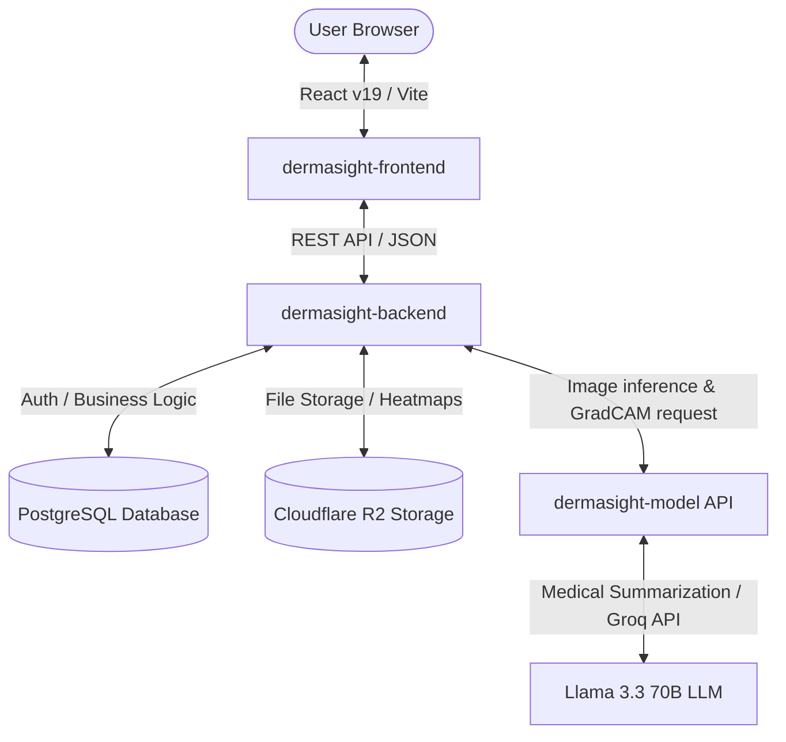

# 🔬 DermaSight: Intelligent Skin Disease Classification & Severity Scoring System

DermaSight is an intelligent web application designed for early detection, classification, and severity scoring of skin lesions. Developed as a Capstone project for **Coding Camp 2026** (under the theme **Healthy Lives & Well-being**), this platform functions as a first-line triage system. It assists users in recognizing the severity of their skin conditions while providing rich, easy-to-understand educational insights powered by Generative AI.

---

## 🏗️ System Architecture & Components

The DermaSight platform is composed of three primary directories, each managing a distinct layer of the stack:



1. **`dermasight-frontend`**: A highly responsive, Pinterest-inspired React 19 web application built with Bun, Tailwind CSS v4, and Framer Motion v12.
2. **`dermasight-backend`**: A Bun-powered Express 5 REST API using Prisma (PostgreSQL). It handles robust user authentication (Paseto v4), Cloudflare R2 image storage integration, and forwards image inference data to the model.
3. **`dermasight-model`**: The machine learning core containing the custom ensemble model (EfficientNetV2S + DenseNet201) and a FastAPI MLOps backend. It processes raw images, performs GradCAM severity scoring, and generates clinical context using Groq LLM.

---

## ⚙️ Environment Setup & Prerequisites

Before setting up the project, ensure you have the following installed on your machine:
- **[Bun](https://bun.sh)** (v1.3+)
- **[Docker & Docker Compose](https://www.docker.com/)** (Recommended for easiest full-stack setup)
- **PostgreSQL 15+** (If running backend natively without Docker)
- **Python 3.9** (If running model API natively without Docker)

### 🔑 Required Credentials & API Keys
To unlock full platform functionality, prepare the following environment variables:
1. **Groq API Key**: For AI-powered patient explanation and summaries. Get one from [Groq Console](https://console.groq.com/keys).
2. **Cloudflare R2 Bucket**: For storing skin images, analysis results, and GradCAM heatmaps.
3. **SMTP Server**: For sending transactional emails and handling contact form inquiries.

---

## 🚀 Quick Start (Production/Ensemble Run via Docker Compose)

The fastest and most reliable way to spin up the **Database**, **Model API**, and **Backend** is using the pre-configured multi-container Docker Compose setup.

### 1. Configure the Backend & Database Environment
Navigate to `dermasight-backend`, copy the example file, and configure your secrets:
```bash
cd dermasight-backend
cp .env.example .env
```
Ensure you fill in your PostgreSQL details, Cloudflare R2 credentials, SMTP settings, and choose a `PASETO_SECRET_KEY` (you can generate one with `bun run token:keygen` in the backend dir).

### 2. Configure the Model API Environment
Navigate to `dermasight-model` and setup the Groq environment:
```bash
cd ../dermasight-model
cp dermasight-api/.env.example dermasight-api/.env
```
Open `dermasight-api/.env` and insert your `GROQ_API_KEY`.

### 3. Spin Up the Services
Go back to the `dermasight-backend` directory and start Docker Compose:
```bash
cd ../dermasight-backend
docker compose up -d
```
Docker Compose automatically manages the database creation, seeds the database with the Prisma migrations and an initial Admin account, pulls/builds the model API, and runs the backend REST API on port `5000`.

### 4. Start the Frontend
With the backend running, spin up the React application:
```bash
cd ../dermasight-frontend
cp .env.example .env.local  # Point VITE_API_URL to http://localhost:5000/api
bun install
bun run dev
```
Open your browser at `http://localhost:5173` to explore DermaSight!

---

## 🛠️ Local Development Setup (Individual Components)

If you prefer to run each component natively for development or debugging, follow the guides below:

### 1. 🔬 Machine Learning Model API (`dermasight-model`)
The FastAPI server exposes endpoints to classify skin lesions and compute severity using GradCAM.

#### Native Setup:
```bash
cd dermasight-model/dermasight-api
python3 -m venv venv
source venv/bin/activate
pip install -r requirements.txt
cp .env.example .env  # Insert GROQ_API_KEY
uvicorn main:app --host 0.0.0.0 --port 8000
```

#### Docker Setup (Alternative):
```bash
cd dermasight-model
cp dermasight-api/.env.example dermasight-api/.env  # Insert GROQ_API_KEY
docker build -f dermasight-api/Dockerfile -t dermasight-model .
docker run -p 8000:8000 --env-file dermasight-api/.env dermasight-model
```
*Access complete interactive Swagger docs at `http://localhost:8000/docs`.*

---

### 🧠 2. Backend REST API (`dermasight-backend`)
Provides database persistence, Prisma ORM adapters, authentication, and custom storage controllers.

```bash
cd dermasight-backend

# Install package dependencies
bun install

# Configure environment keys
cp .env.example .env

# Generate a strong PASERK-format key pair for Paseto v4 tokens
bun run token:keygen

# Run Prisma schema migrations and seed initial databases
bun run db:generate
bun run db:migrate -- --name init

# Start the local hot-reloading development server
bun run dev
```

#### Key Scripts:
- `bun run dev`: Start dev server with file-watching.
- `bun run db:generate`: Regenerate the Prisma Client.
- `bun run db:migrate -- --name <name>`: Create and deploy local Prisma migrations.
- `bun test`: Run test suites.

---

### 🎨 3. Frontend Web Interface (`dermasight-frontend`)
A sleek visual interface utilizing a modern, warm-cream Pinterest aesthetic.

```bash
cd dermasight-frontend

# Install front-end dependencies
bun install

# Build static variables
cp .env.example .env.local

# Run local development server
bun run dev
```

#### Key Scripts:
- `bun run dev`: Starts Vite dev server.
- `bun run build`: Prepares production-optimized bundles in the `dist` directory.
- `bun run lint:eslint` & `bunx biome format --write .`: Ensure high-quality code formatting.

---

## 📊 Technical Capabilities

### 🩺 Machine Learning Classifier
- **Model Architecture**: Ensemble Transfer Learning combining **EfficientNetV2S (60% weight)** + **DenseNet201 (40% weight)**.
- **Accuracy**: **85.49%** on the validation set.
- **Class Labels**:
  - `0`: **Basal Cell Carcinoma** (BCC — Malignant)
  - `1`: **Melanocytic Nevi** (NV — Benign)
  - `2`: **Melanoma** (MEL — Highly Malignant)

### 📈 Severity Scoring Model
The system calculates a severity index at the API layer based on three weighted variables:
$$\text{Combined Score} = (0.50 \times \text{GradCAM Area}) + (0.30 \times \text{Malignancy Class Score}) + (0.20 \times \text{Site Risk Score})$$

- **GradCAM Area**: Extracts pixel-level heatmaps to measure the physical spread and irregularity of the lesion.
- **Malignancy Score**: Calculated from lesion malignancy configurations (Benign Nevi = 0.1, BCC = 0.7, Melanoma = 0.9).
- **Site Risk Score**: Assesses the anatomical risk of the affected body area.

#### Severity Categories:
- 🟢 **Mild**: Combined Score $\le 0.25$
- 🟠 **Moderate**: $0.25 < \text{Score} \le 0.50$
- 🔴 **Severe**: Combined Score $> 0.50$

---

## 🔒 Security & Best Practices
- **Auth Token Delivery**: Access Tokens are transmitted via secure `Authorization: Bearer` headers, while Refresh Tokens are sent via HTTP-Only, signed cookies to eliminate XSS/CSRF token leakage.
- **Image Preprocessing**: Preprocessing (resizing to 224x224, pixel scaling) is embedded natively inside the ML model pipeline. There is no need for clients to normalize images before posting.
- **API Spec**: Complete OpenAPI 3.0 specs are available under `dermasight-backend/docs/openapi.json`.
