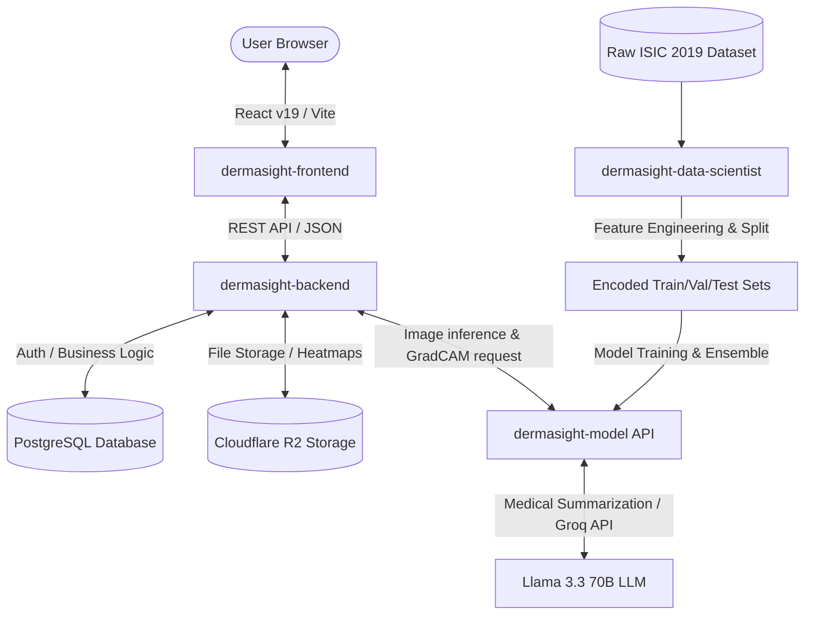

# DermaSight: Intelligent Skin Disease Classification & Severity Scoring System

DermaSight is an intelligent web application designed for early detection, classification, and severity scoring of skin lesions. Developed as a Capstone project for **Coding Camp 2026** (under the theme **Healthy Lives & Well-being**), this platform functions as a first-line triage system. It assists users in recognizing the severity of their skin conditions while providing rich, easy-to-understand educational insights powered by Generative AI.

---

## System Architecture & Components

The DermaSight workspace is organized into four main directories, each representing a key layer of the project's data science, machine learning, and application development pipeline:

### 1. [Front-End](./dermasight-frontend/README.md)
A highly responsive, Pinterest-inspired React 19 web application built with Bun, Tailwind CSS v4, and Framer Motion v12.
* 👉 **Setup & Running Instructions**: Refer to the [Frontend README](./dermasight-frontend/README.md).

### 2. [Back-End](./dermasight-backend/README.md)
A Bun-powered Express 5 REST API using Prisma (PostgreSQL). It handles robust user authentication (Paseto v4), Cloudflare R2 image storage integration, and forwards image inference data to the model.
* 👉 **Setup & Running Instructions**: Refer to the [Backend README](./dermasight-backend/README.md).

### 3. [AI Model](./dermasight-model/README.md)
The machine learning core containing the custom ensemble model (EfficientNetV2S + DenseNet201) and a FastAPI MLOps backend. It processes raw images, performs GradCAM severity scoring, and generates clinical context using Groq LLM.
* 👉 **Setup & Running Instructions**: Refer to the [Model README](./dermasight-model/README.md).

### 4. [Data](./dermasight-data-scientist/README.md)
The data science module focusing on the analysis of skin lesion characteristics, feature engineering (Age Group, Risk Category, Site Risk Score), and dataset preparation (using ISIC 2019). It also contains a Streamlit dashboard for data exploration, validation of dataset readiness, and correlation analysis.
* 👉 **Setup & Running Instructions**: Refer to the [Data Scientist README](./dermasight-data-scientist/README.md).

---

## Setup & Execution Guide (Global Overview)

For local development and individual module setup instructions, please visit the respective component documentation links above. Below is a global overview of how to run the components:

### Docker Compose (Full Stack Orchestration)
A multi-container configuration is provided in the backend directory to orchestrate the PostgreSQL database, initial database migrations & seeding, FastAPI model API, and the Express backend.
* 👉 For detailed steps, configuration variables, and execution, refer to the **Deployment** section of the [Backend README](./dermasight-backend/README.md#deployment).

### Individual Run Commands
If running services natively outside of Docker:
- **Frontend**: Exposes a hot-reloading Vite server.
- **Backend**: Runs a Bun-based development server connected to your PostgreSQL instance.
- **Model API**: Spins up a FastAPI server using Uvicorn.
- **Data Science Dashboard**: Launches an interactive dashboard via Streamlit.

For precise commands and steps for these, visit the respective links under [System Architecture & Components](#%EF%B8%8F-system-architecture--components).

---

## Technical Capabilities

### Machine Learning Ensemble
- **Model Architecture**: Ensemble Transfer Learning combining **EfficientNetV2S (60% weight)** + **DenseNet201 (40% weight)**.
- **Accuracy**: **85.49%** on the validation set.
- **Class Labels**:
  - `0`: **Basal Cell Carcinoma** (BCC — Malignant)
  - `1`: **Melanocytic Nevi** (NV — Benign)
  - `2`: **Melanoma** (MEL — Highly Malignant)

### Severity Scoring Model
The system calculates a severity index at the API layer based on three weighted variables:
$$\text{Combined Score} = (0.50 \times \text{GradCAM Area}) + (0.30 \times \text{Malignancy Class Score}) + (0.20 \times \text{Site Risk Score})$$

- **GradCAM Area**: Measures the physical spread and irregularity of the lesion from pixel-level heatmaps.
- **Malignancy Score**: Numerical weight representing relative risk per diagnosis (Benign Nevi = 0.1, BCC = 0.7, Melanoma = 0.9).
- **Site Risk Score**: Assesses the anatomical risk of the affected body area.

#### Severity Categories:
- 🟢 **Mild**: Combined Score $\le 0.25$
- 🟠 **Moderate**: $0.25 < \text{Score} \le 0.50$
- 🔴 **Severe**: Combined Score $> 0.50$

---

## Security & Best Practices
- **Token Delivery**: Paseto v4 access tokens are transmitted via `Authorization: Bearer` headers, while refresh tokens are set via secure, HTTP-Only, signed cookies to prevent token theft.
- **Internal Preprocessing**: The ML model includes custom preprocessing layers, meaning input images only require resizing to $224 \times 224$ pixels without manual client-side normalization.
